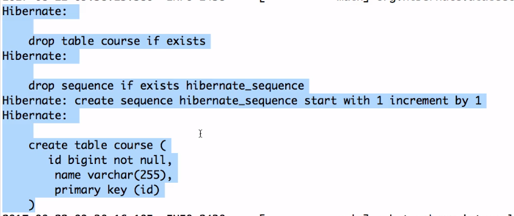

## Configuring H2 in project
Just add
```
spring.h2.console.enabled=true
```
to application.properties.

Service is gonna run at the /h2-console URI.
<br>
With the latest versions of Spring Boot (2.3+), the H2 database name is randomly generated each time you restart the server.

You can find the database name and URL from the console log.
Add this to application properties
```
spring.datasource.url=jdbc:h2:mem:testdb
spring.data.jpa.repositories.bootstrap-mode=default
```

## Initialize the H2 DB
add a data.sql file to src/main/resources for Spring Boot release greater than 2.5.0
if you use this version just add this properties to application.properties.
```
spring.jpa.defer-datasource-initialization=true
```
or use schema.sql instead of data.sql
<br>
When db first initialized it is gonna execute command in this file.

## JDBC vs Spring JDBC
Jdbc is very complex and unmaintaineble code. Spring saves from those boilerplate codes.

```
@Entity // mark class as entity
```
```
@Column //mark fielda as column
```
```
@Id
@GeneratedValue //let hibernate managed the id, typically it creates a sequence in db
```
* We need to have a no args contructor
```
// connect to the database
@PersistenceContext
EntityManager entityManager;
```

```
spring.jpa.show-sql=true
```

## Some configs that helps
```
# Enabling H2 Console
spring.h2.console.enabled=true

#Turn Statistics on
spring.jpa.properties.hibernate.generate_statistics=true
logging.level.org.hibernate.stat=debug

# Show all queries
spring.jpa.show-sql=true
spring.jpa.properties.hibernate.format_sql=true
logging.level.org.hibernate.type=trace
```
When this configs defined the app. logs becomes like this.


## Writing Test Methods For Repository
The @SpringBootTest annotation tells Spring Boot to look for a main configuration class (one with @SpringBootApplication, for instance) and use that to start a Spring application context. 

```
A nice feature of the Spring Test support is that the application context is cached between tests. That way, if you have multiple methods in a test case or multiple test cases with the same configuration, they incur the cost of starting the application only once. You can control the cache by using the @DirtiesContext annotation.
```
You need to use @DirtiesContext where you test your data changes. Because you can delete, update or insert
data and other test should not affect these changes. So we use this annotation to reset the changes
happened in current unit test.

```
@RunWith(SpringRunner.class)
@SpringBootTest(classes=DemoApplication.class)
public class CourseRepositoryTest {
	
	private Logger logger = LoggerFactory.getLogger(this.getClass());
	
	@Autowired
	CourseRepository repository;
	
	@Test
	public void findById_basic() {
		Course course = repository.findById(10001L);
		assertEquals("JPA in 50 Steps", course.getName());
	}

}
```

## Delete By Id
When we call this method
```
    public void deleteById(Long id){
        Course course = findById(id);
        em.remove(course);
    }
```

Spring raises an error that it needs a transaction. So we add Spring @Transactional annotation
to the repository.


## EntityManager
```
public void playWithEntityManager() {
		Course course = new Course("Web Services in 100 Steps");
		em.persist(course);
		course.setName("Web Services in 100 Steps - Updated");
	}
```
When we run this code, it first creates an insert script then an update scripts. Why?
Because we use @Transactional at the class level and EntityManager keep tracks the
changes in method.

### Detach Method
em.flush() eagerly updates the changes in db.
em.detach(obj), breaks the keeping track the obj. So the changes
on that obj doesn't reflect on to database.
<br>
There is also another method em.clear() which breaks all the tracking objects.
 
```
public void playWithEntityManager() {
		
		Course course1 = new Course("Web Services in 100 Steps");
		em.persist(course1);	
		
		Course course2 = new Course("Angular Js in 100 Steps");
		em.persist(course2);

		em.flush();

		course1.setName("Web Services in 100 Steps - Updated");
		course2.setName("Angular Js in 100 Steps - Updated");
		
		em.refresh(course1);
		
		em.flush();
	}
```


## Cache
Two level cache available. First level cache lives within a single transaction.
Second level cache is cache across all transactions.

Here is how first level cache works.
```
public void findById() {
    Course course = repository.findById(100l);
    Course course1 = repository.findById(100l);
} 
```

If we call this method twice then jpa will go to db twice. But if we put @Transactional annotation to the method
then the second method call doesn't go to db. Because it will be cached. Because first level cache lives within the 
boundaries of the transaction.
<br>
In the first example it doesnt cached because the two method calls live within another transaction boundaries.
<br>
Q1: What is the difference to use Transactional annotation at class level and method level?

> In case 1 @Transactional is applied to every public individual method. Private and Protected methods are Ignored by Spring. In case 2 @Transactional is only applied to method2(), not on method1()

> Case 1: - Invoking method1() -> a transaction is started. When method1() calls method2() no new transaction is started, because there is already one

> Case 2: - Invoking method1() -> no transaction is started. When method1() calls method2() NO new transaction is started. This is because @Transactional does not work when calling a method from within the same class. It would work if you would call method2() from another class.
Yukarıdaki ilk örnekte repository class üzerinde transaction anotasyon vardı. Bu sebeple o sınıfın herhangi
bir methodu çağrıldığında hepsi aynı transaction içinde yaşar.

### Second Level Cache
Second level cache needs configuration. We can use ehcache.
@Cacheable anotasyonu entity class'a ekleyerek o entity'i cacheleyebiliriz.

## Hard Delete Soft Delete
We just add an entity called isDeleted and add an annotation to the top of the entity @SQLDelete.
Its a hibernate annotations not JPA.

```
@SQLDelete(sql="update course set is_deleted=true where id=?")
```
Filtering Entities with @Where

> Suppose we want to provide an additional condition to the query whenever we request some entity.

> For instance, we need to implement “soft delete”. This means that the entity is never deleted from the database, but only marked as deleted with a boolean field.

> We'd have to take great care with all existing and future queries in the application. We'd have to provide this additional condition to every query. Fortunately, Hibernate provides a way to do this in one place:

To be able to fetch the true records in select statements we just need to add annotation
```
@Where(clause="is_deleted = false")
```
This annotation adds this criteria in every select statements.
<br>
This annotation doesnt apply to native queries.