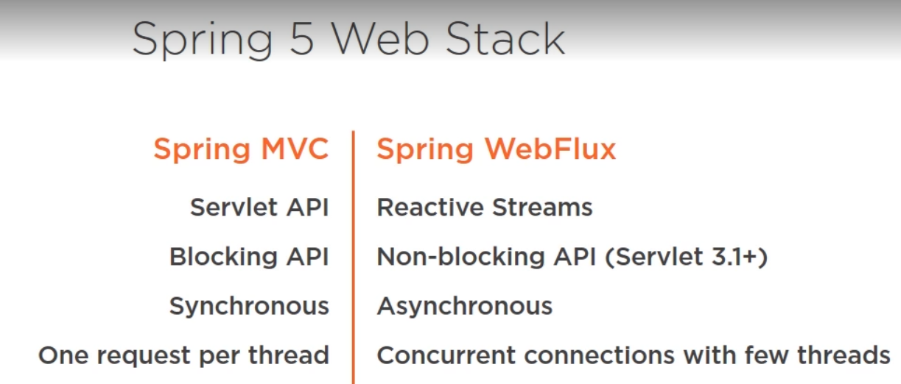
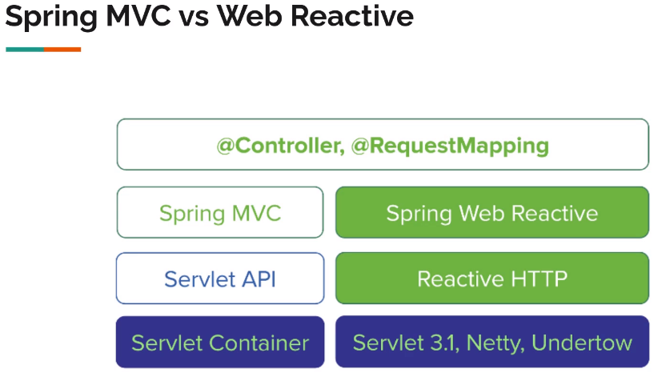
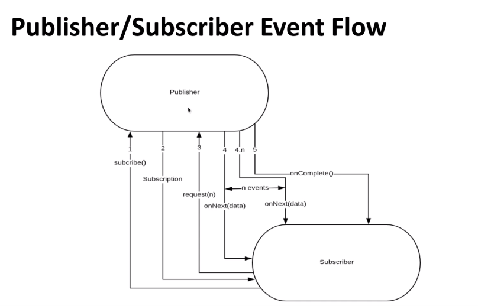
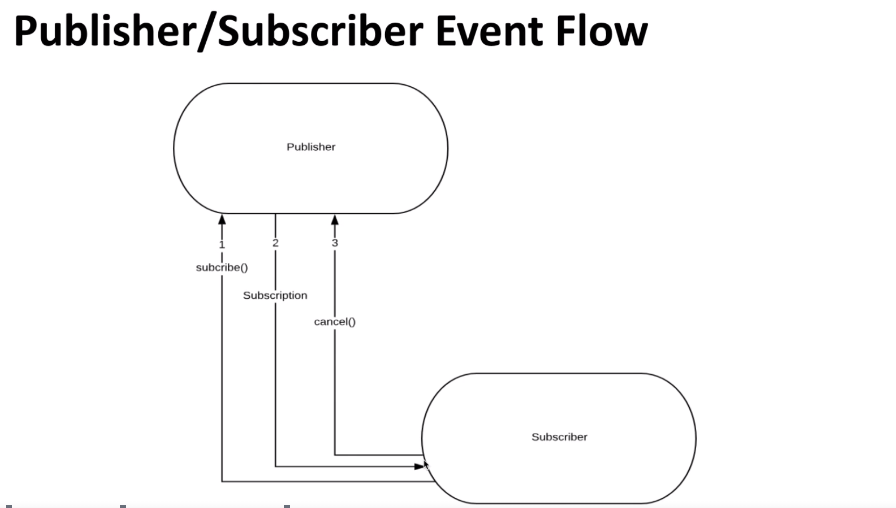
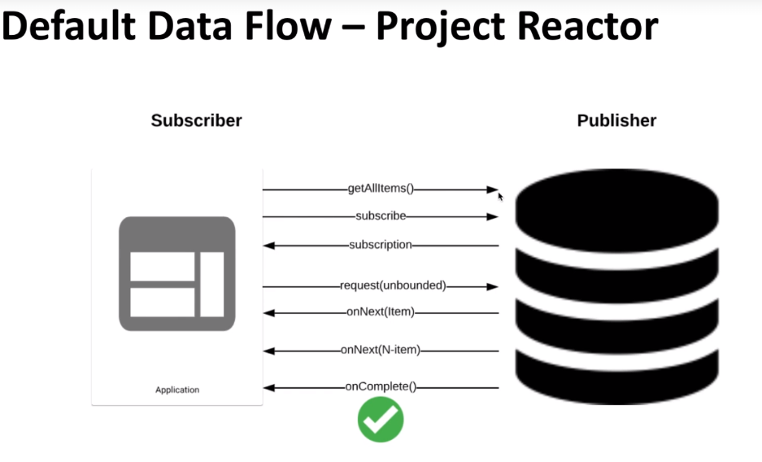
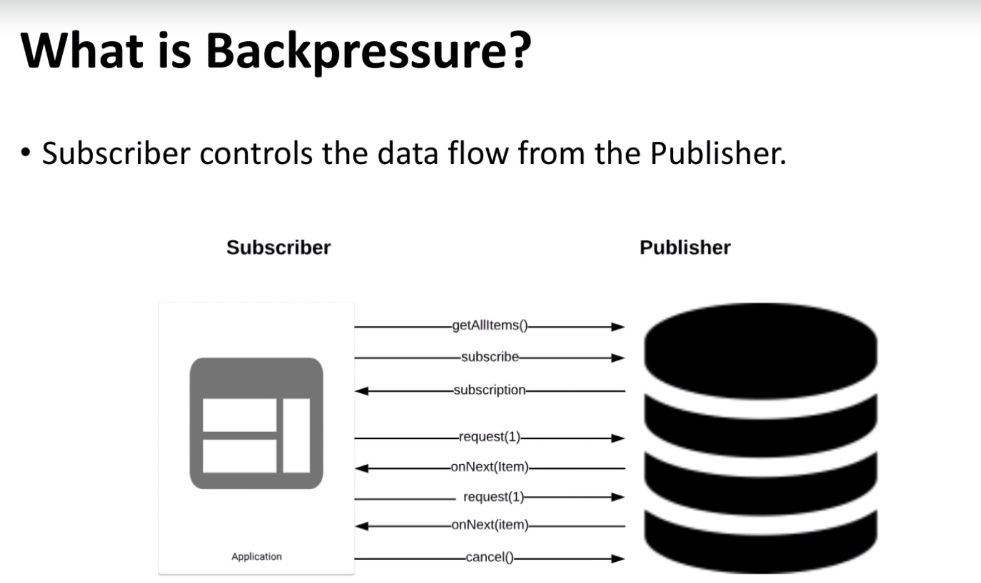

Reactive is an architectural style that allows an application to react to changes by being able to scale up and down
or recover from failures. We can also write a part of an application with reactive programming style
but this doesn't mean that the whole system is reactive.

A reactive system is;
* Responsive : it has to respond quickly to all users under all conditions.
* Resilient
* Scalable : up and down based on demand
* Message Driven : Reactive systems are driven by messages to ensure that the components of the system can be scaled independently
and loosely coupled.

Sometimes messages are called events but they are not the same thing. Unlike event messages has explicit destination.
When events happen there are listeners to listen those events.

Reactive programming involves three concepts.
* Non-blocking programming
* Asynchronous programming
* Functional/Declarative

## Non-blocking
Most of the time we use blocking operations like call something on db. Another example can be web servers.
They have a thread pool and request are handled by this threads via blocking API.
<br>
Those threads have their own stack and consumes memory. So when you need to scale up to more than 500 req/s
you need to increase the thread size. And that means you need more memory. So this is an example of ineffiecient usage of memory
and CPU cycles because program does nothing when it is waiting some resources.
<br>
Reactive web applications adopt non-blocking servers generally based on the event loop model.
In this model there is small number of thread handling requests.
<br>
When a request is handled by a thread, it is divided into events. These events wait to be processed.
But the important thing here is waiting time is very small. Because when there is blocking operation
needed like connecting database, connecting file system or intensive computation, these events handled
by other available worker threads. And when the operation is done a new event is generated a signal that the operation
is completed.
<br>
Thats why web servers work like this type are more scalable and handle more request.

## Asynchronous Programming
It is about executing operation in background so it can execute other things without waiting operation to finish.
We use callback to get the result when the operation finishes.
We can use Thread pools, ForkJoin Framework, Parallel Streams or Completable Future to implement callback operations.

## Functional/Declarative
Reactive libraries use concepts of functional programming.
Functional programming is more declarative and maintainable then imperative programming. 
In imperative programming you have to explicitly tell the program what to do and how to do it.
In functional programming style we use pure functions which is more readable, maintainable and also
use the power of modern multicore CPU's.
<br>
We process the sequence of events and this known as stream.
The iniative to standardized libraries that process the streams in an asynchronous, non-blocking way with
backpressure capabilities is called Reactive Streams.
This is different than the Java Stream API. The both have similar API but they work in a different ways.
<br>
The Stream API connects to a source, pulls the values and it can be used only once.
<br>
In a Reactive Stream values are not pulled, they are pushed through the pipeline of operators
when you subscribe and they have backpressure mechanism

## Spring MVC vs Spring Webflux
put image here

## Reactive Stack
The important thing is reactive systems is all the layers in reactive stack needs to be
non-blocking and asynchronous.
You have to use non-blocking server, web layer needs to be webflux, data layer needs to be reactive spring data.
Spring also have reactive starters in spring boot 2.

Webflux supports many implementation libraries like:
* Reactor
* RxJava
* RxJava2
* CompletableFuture

Project Reactor is the default and preferred reactive library to work with WebFlux.
NOTE: Reactive programming,reactive manifesto, reactive systems can be seem same but they are different.
Reactive programming is driven by events

# Reactive Streams
The purpose of Reactive Streams is to provide a standard for asynchronous stream processing with non-blocking backpressure.
The purpose of the reactive streams is to provide a contract:
* Asynchronous
* Non-blocking
* Backpressure
to support this functionality. This is a specification.

developed by lightbend, netflix,twitter

In summary, Reactive Streams is a standard and specification for Stream-oriented libraries for the JVM that

 - process a potentially unbounded number of elements
 - in sequence,
 - asynchronously passing elements between components,
 - with mandatory non-blocking backpressure.

The Reactive Streams specification consists of the following parts:

***The API*** specifies the types to implement Reactive Streams and achieve interoperability between different implementations.

***The Technology Compatibility Kit (TCK)*** is a standard test suite for conformance testing of implementations.

Implementations are free to implement additional features not covered by the specification as long as they conform to the API requirements and pass the tests in the TCK.

### API Components ###

The API consists of the following components that are required to be provided by Reactive Stream implementations:

1. Publisher
2. Subscriber
3. Subscription
4. Processor

A *Publisher* is a provider of a potentially unbounded number of sequenced elements, publishing them according to the demand received from its Subscriber(s).

```
Core Interfaces

public interface Publisher<T> {
    public void subscribe(Subscriber<? super T> s);
}

public interface Subscriber<T> {
    public void onSubscribe(Subscription s);
    public void onNext(T t);
    public void onError(Throwable t);
    public void onComplete();
}

public interface Subscription {
    public void request(long n);
    public void cancel();
}

public interface Processor<T, R> extends Subscriber<T>, Publisher<R> {
}
```

Publisher, publish elements to any number of subscribers, at the rate specified through a subscription.
Processors are publishers and subscribers at the same time. They are hard to use correctly and most of the time you
wont need them.

> A Publisher of type T will publish elements of type T or a subclass of T to its subcribers.

> onSubscribe() is called when the subscriber subscribes to a publisher. Subscription object is passed
to this method.
> onNext() method is always called when an an element is sent to the subscriber

> If there is an exceptions at some point, onError() is called with this exception.

> Finally, when all the elements are published the method onComplete() is executed.

> request() method in Subscription, request to the publisher any number of elements. This represents backpressure mechanism.

> cancel() , cancels the subscription

This is how they work;
- First, the subscribe method is called on the publisher.
- Then, a subscription object is created and the onSubscribe method of the subscriber is executed, passing the subscription object.
- To start receiving element, a subscriber must execute the request method indicating how many elements it can process. If you
don't call explicitly, an unbounded number of elements is requested.
- Subscriber then receive elements via the onNext method. It receives elements until 3 things happen.
- One, publisher sends all the elements requested via request method.
- Two, if there are no elements to send, puslisher calls the onComplete method and subscription is cancelled.
- If at some points there is an error, the publisher calls the onError method and subscription is cancelled.

### Project Reactor
The default reactive programming library in Spring WebFlux.
Provides two implementations for publisher interface. 
- Mono to publish 0 or 1 element.
- Flux, publish more than 1 element.
This is for clarity. 
<p>
Think Mono like reactive version of Optional type in Java.
Think Flux like list.






# PROGRAMMING
Define flux and subcribe it.

```
Flux<String> stringFlux = Flux.just("Spring", "Spring Boot", "Reactive String");
stringFlux.subscribe(System.out::println);
```
If we log everything just typing `Flux.just("Spring", "Spring Boot", "Reactive String").log();`<br>
It prints everything under the hood.
```
23:20:15.862 [main] DEBUG reactor.util.Loggers - Using Slf4j logging framework
23:20:15.874 [main] INFO reactor.Flux.Array.1 - | onSubscribe([Synchronous Fuseable] FluxArray.ArraySubscription)
23:20:15.876 [main] INFO reactor.Flux.Array.1 - | request(unbounded)
23:20:15.876 [main] INFO reactor.Flux.Array.1 - | onNext(Spring)
Spring
23:20:15.876 [main] INFO reactor.Flux.Array.1 - | onNext(Spring Boot)
Spring Boot
23:20:15.876 [main] INFO reactor.Flux.Array.1 - | onNext(Reactive String)
Reactive String
23:20:15.876 [main] INFO reactor.Flux.Array.1 - | onComplete()
```

If we raise exception, we can handle it
```
   Flux<String> stringFlux = Flux.just("Spring", "Spring Boot", "Reactive String")
                .concatWith(Flux.error(new RuntimeException("err"))).log();

        stringFlux.subscribe(System.out::println, throwable -> System.err.println(throwable));
```

```
23:23:49.942 [main] DEBUG reactor.util.Loggers - Using Slf4j logging framework
23:23:49.957 [main] INFO reactor.Flux.ConcatArray.1 - onSubscribe(FluxConcatArray.ConcatArraySubscriber)
23:23:49.959 [main] INFO reactor.Flux.ConcatArray.1 - request(unbounded)
23:23:49.960 [main] INFO reactor.Flux.ConcatArray.1 - onNext(Spring)
Spring
23:23:49.960 [main] INFO reactor.Flux.ConcatArray.1 - onNext(Spring Boot)
Spring Boot
23:23:49.960 [main] INFO reactor.Flux.ConcatArray.1 - onNext(Reactive String)
Reactive String
23:23:49.961 [main] ERROR reactor.Flux.ConcatArray.1 - onError(java.lang.RuntimeException: err)
23:23:49.967 [main] ERROR reactor.Flux.ConcatArray.1 - 
java.lang.RuntimeException: err
	at com.guzelcihad.reactivedemo.FluxAndMonoTest.fluxTest(FluxAndMonoTest.java:14)
	at java.base/jdk.internal.reflect.NativeMethodAccessorImpl.invoke0(Native Method)
```

Subscriber method can take 3 parameters. 
* The first takes lambda to perform when an onNext called
* The second takes lambda to perform when an onError called
* The third one takes lambda to perform when onComplete called.

## Step Verifier Class
Subscribe to publisher and verifies data in order

```
    @Test
    public void fluxTestElements() {
        Flux<String> stringFlux = Flux.just("Spring", "Spring Boot", "Reactive Spring");
        StepVerifier.create(stringFlux)
                .expectNext("Spring")
                .expectNext("Spring Boot")
                .expectNext("Reactive Spring")
                .verifyComplete();
    }
```

Test error is expected 
```
    @Test
    public void fluxTestElementsWithError() {
        Flux<String> stringFlux = Flux.just("Spring", "Spring Boot", "Reactive Spring")
                .concatWith(Flux.error(new RuntimeException("An error occured")))
                .log();

        StepVerifier.create(stringFlux)
                .expectNext("Spring")
                .expectNext("Spring Boot")
                .expectNext("Reactive Spring")
                //.expectError(RuntimeException.class)
                .expectErrorMessage("An error occured")
                .verify();
    }
```

## Factory Methods
```
public class FactoryMethods {

    List<String> names = List.of("Adam", "Anna", "Jack", "Jenny");
    
    @Test
    public void fluxUsingIterable() {
        Flux<String> namesFlux = Flux.fromIterable(names);

        StepVerifier.create(namesFlux.log())
                .expectNextCount(4)
                .verifyComplete();
    }

    @Test
    public void fluxFromArray() {
        String[] strings = names.toArray(String[]::new);
        Flux<String> stringFlux = Flux.fromArray(strings);

        StepVerifier.create(stringFlux.log())
                .expectNextCount(4)
                .verifyComplete();
    }

    @Test
    public void fluxFromStream() {
        Stream<String> stream = names.stream();
        Flux<String> stringFlux = Flux.fromStream(stream);

        StepVerifier.create(stringFlux.log())
                .expectNextCount(4)
                .verifyComplete();
    }

    @Test
    public void monoNullOrEmpty() {
        Mono<Object> objectMono = Mono.justOrEmpty(null);
        StepVerifier.create(objectMono.log())
                .verifyComplete();
    }

    @Test
    public void monoFromSupplier() {
        Mono<String> stringMono = Mono.fromSupplier(() -> "Adam");
        StepVerifier.create(stringMono.log())
                .expectNext("Adam")
                .verifyComplete();
    }

    @Test
    public void fluxFromRange() {
        Flux<Integer> range = Flux.range(1, 5);
        StepVerifier.create(range.log())
                .expectNext(1,2,3,4,5)
                .verifyComplete();
    }
}
```

## Flux Filter
```
public class FluxWithFilter {

    List<String> names = List.of("Adam", "Anna", "Jack", "Jenny");

    @Test
    public void filterTest() {
        Flux<String> stringFlux = Flux.fromIterable(names)
                .filter(s -> s.startsWith("A"))
                .log();

        StepVerifier.create(stringFlux)
                .expectNext("Adam", "Anna")
                .verifyComplete();
    }
}
```

## FlatMap
Usefull in db or request call operations.<br>
takes parameter and return Flux<String>

Example
```
    @Test
    public void flatMap() {
        Flux<Object> flatMap = Flux.fromIterable(names)
                .flatMap(s -> {
                    return Flux.fromIterable(convertToList(s));
                });

        flatMap.subscribe(s -> System.out.println(s)); //prints 12 elements
    }

    private List<String> convertToList(String s) {
        return List.of(s, "newValue");
    }
```

## Merge, Concat, Zip
```
  Flux<String> flux1 = Flux.just("A", "B");
        Flux<String> flux2 = Flux.just("C", "D");
        Flux<String> merge = Flux.merge(flux1, flux2);

        StepVerifier.create(merge.log())
                .expectNextCount(4)
                .verifyComplete();
```

zip outputs like this AC, BD 

## Backpressure
Subscriber controls the flow




```
  Flux<Integer> log = Flux.range(1, 10).log();

        StepVerifier.create(log)
                .expectSubscription()
                .thenRequest(1)
                .expectNext(1)
                .thenRequest(1)
                .expectNext(2)
                .thenCancel()
                .verify();
```
Outputs:
```
00:34:57.900 [main] INFO reactor.Flux.Range.1 - | onSubscribe([Synchronous Fuseable] FluxRange.RangeSubscription)
00:34:57.904 [main] INFO reactor.Flux.Range.1 - | request(1)
00:34:57.904 [main] INFO reactor.Flux.Range.1 - | onNext(1)
00:34:57.904 [main] INFO reactor.Flux.Range.1 - | request(1)
00:34:57.904 [main] INFO reactor.Flux.Range.1 - | onNext(2)
00:34:57.905 [main] INFO reactor.Flux.Range.1 - | cancel()
00:34:57.905 [main] INFO reactor.Flux.Range.1 - | request(unbounded)
```

An example of subsriber
```
    @Test
    public void subscriptionExample() {
        Flux<Integer> flux = Flux.range(1, 10).log();

        flux.subscribeWith(new BaseSubscriber<Integer>() {
            @Override
            protected void hookOnNext(Integer value) {
                System.out.println("integer = " + value);
            }

            @Override
            protected void hookOnError(Throwable throwable) {
                System.err.println("Exception is: " + throwable);
            }

            @Override
            protected void hookOnSubscribe(Subscription subscription) {
                subscription.request(2);
            }
        });

    }
```

Subscription with cancel method

```
finiteFlux.subscribeWith(new BaseSubscriber<Integer>() {
    @Override
    protected void hookOnNext(Integer value) {
        System.out.println("integer = " + value);
    }
 
    @Override
    protected void hookOnError(Throwable throwable) {
        System.err.println("Exception is: " + throwable);
    }
 
    @Override
    protected void hookOnSubscribe(Subscription subscription) {
        subscription.cancel();
    }
});
```

## Hot and Cold Reactive Streams?

## Functional Web
Use functions to route to request and response.<br>
two functions available. Router function and handler function

## Netty
Asynchronous event driven network app. framework for rapid development
of maintainable high performance  protocol or servers.
<br>
Facebook, twitter, google, instagram
<br>
Support http, sftp, ftp, websocket etc

## Why use flatMap in update operation

```
return itemReactiveRepository.findById(id) // Mono<Item>
        .flatMap(currentItem -> {
 
            currentItem.setPrice(item.getPrice());
            currentItem.setDescription(item.getDescription());
            return itemReactiveRepository.save(currentItem); // Changed Mono<Item> to Item
        })
        .map(updatedItem -> new ResponseEntity<>(updatedItem, HttpStatus.OK))
        .defaultIfEmpty(new ResponseEntity<>(HttpStatus.NOT_FOUND));
```

We have a transformation thats happening here too thats why I have used flatMap.

The transformation is converting from Mono<Item> to Item using the flatMap. I have provided that in the code comments below.

This kind of conversion would never be possible using map method.
> PS: FlatMap in the project reactor is different from flatMap in Java8 streams API.

## Webclient
Its a class to build non-blocking client application in reactor. Its similar
to RestTemplate.

## Streaming Real Time Data Through an Endpoint
Its also known as Server side events. So, what is it?
* An endpoint once the connection  is made its going to keep pushing the data to the client as the 
new data available.