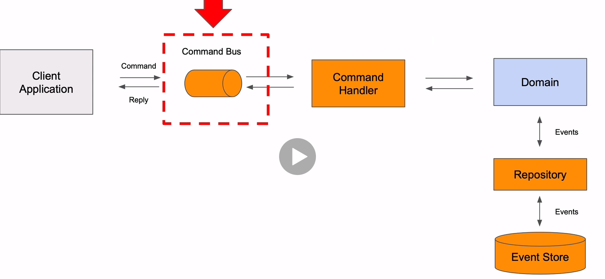

What is cqrs?
> Design pattern that suggests application should be divided in a command and query part.
> Command alters the state of an object or entity, and queires return the state of an object or entity.
Why we need?
> It allows us to scale command and query part independently. We optimize for high performance.

What is event sourcing?

> Event sourcing defines an approach where all the changes that are made to an object or entity,
> are stored as a sequence of immutable events to an event store, as opposed
> to storing just the current state.

* Event sourcing usually use with cqrs to response events.

## Axon
* Is a platform that consists of Axon Framework and Axon Server.
* Axon Framework is a java framework that is used to simplify the building
of event-driven microservices that are based on CQRS, event-sourcing and DDD.
* It is designed to separate business logic from infrastructural concerns.
* Business logic implemented in classes that interact with the different message buses.
* Axon server is an out of the box message router and event store that requires no spesific configuration.

## Axon Programming
We use `CommandGateway` class for sending create command to axon framework.

### Aggregate Class
Domain object that holds the current state of the main object.
For product domain, it is called ProductAggregate and it holds the current state of the product.

When a CreateProductCommand request made, ProductAggregate class is responsible for 
handling these request, validate and fire and event.

Note: Event handler in query api side.

Genel olarak yapı şöyle işliyor.
Controller -> burada bi gateway oluyo axon saglıyo -> sonra bir handler class oluyo yine axon saglıyo

We can use validation before process it or we can do it in the command handler. We've already done it `ProductAggregate` class
 
Another way we can do validation is to writing a message interceptor. When we send message via command gateway we can 
intercept this message and do some stuff.

### Order Microservice

