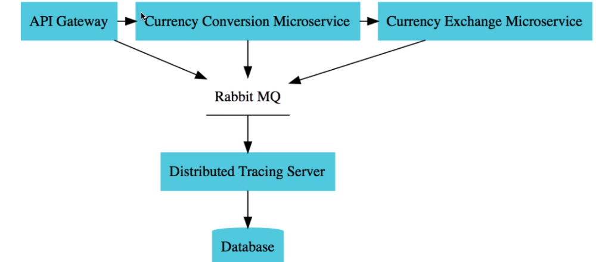

How can we track the communication in ms?
* Using distributed tracing tool. All services interact within this tool and the tool stores data in db.
Zipkin is one of tool.

Install zipkin
```  
docker run -d -p 9411:9411 openzipkin/zipkin
```  



We need to add these dependencies to be able to trace microservices.

``` 
<dependency>
            <groupId>org.springframework.cloud</groupId>
            <artifactId>spring-cloud-starter-sleuth</artifactId>
        </dependency>

        <dependency>
            <groupId>org.springframework.cloud</groupId>
            <artifactId>spring-cloud-sleuth-zipkin</artifactId>
        </dependency>

<!--        <dependency>
            <groupId>org.springframework.amqp</groupId>
            <artifactId>spring-rabbit</artifactId>
        </dependency>-->
``` 

When running application, and trigger a request for microservices, zipkin are gonna
trace. 