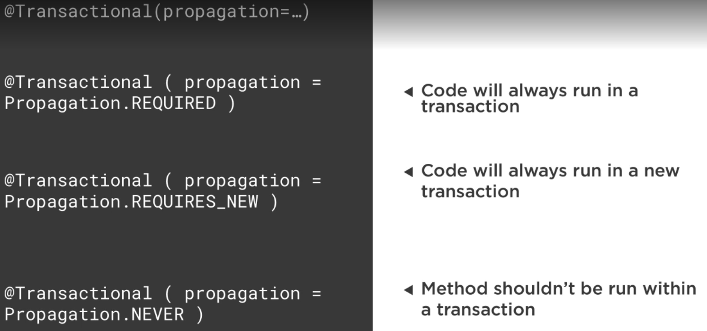

Transaction management ensures data consistency and integrity.
- Spring provides enhanced feature to manage transactions. There are two API's available
declarative and imperative

- Spring handles transaction management via AOP. It intercepts the method valls via proxy and
then create transaction logics.

